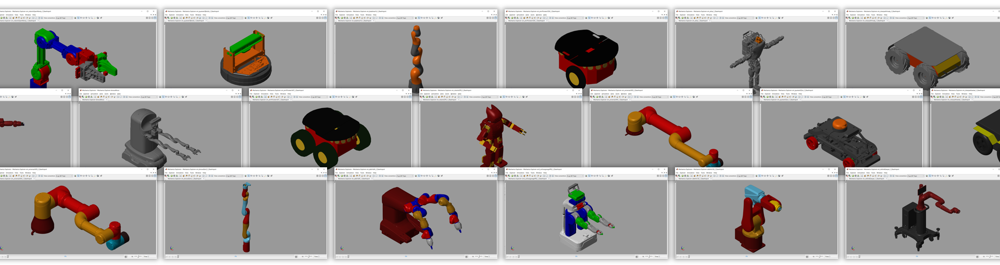

# 🛠️ Mechanical Engineering Vac Work Simulation Bootcamp  

## Applying AI to Enable Autonomy in Robotics using MATLAB  

This Bootcamp is designed for mechanical engineering students seeking vacation work experience and are passionate about AI, robotics, as well as leveraging MATLAB and Simulink for modelling and simulation. The Bootcamp aims to enhance the students’ understanding of Simulink fundamentals and how to apply various simulation concepts in real-world applications by modelling a robot that is enabled by Artificial Intelligence.

Throughout this Bootcamp, students will gain hands-on experience in robotics, control systems design, artificial intelligence and how to integrate AI into models developed in Simulink, as well as autonomous robot simulation and modelling which are critical skills required in the automotive and robotics industries. By the end of the Bootcamp, students will be able to model and simulate robots using Simulink and Simscape, integrate AI (and LLM’s) into models, as well as understand introductory control systems concepts and their integration with digital twins.

This Bootcamp is brought to you by **Opti-Num Solutions**, in partnership with the **University of Pretoria**. Together, our goal is to elevate the research and innovation at institutions, as well as provide an alternative but equally meaningful way for students to gain work experience by working on real world systems.

---

## 📅 Bootcamp Dates  
**14 – 18 July 2025**  
Location: University of Pretoria

---

## 📆 Bootcamp Schedule  

| **Session**                             | **Date**        | **Time**                  |
|----------------------------------------|------------------|----------------------------|
| Introduction & Instructor-led Training | Mon, 14 July     | 08:00 – 17:00 (1hr break) |
| Instructor-led Training Day 2          | Tue, 15 July     | 08:00 – 17:00 (1hr break) |
| Optional Training & Task 1 Begins      | Wed, 16 July     | 08:00 – 17:00 (1hr break) |
| Task 1 – Robot Modelling & Simulation  | Thu, 17 July     | 08:00 – 17:00 (1hr break) |
| Task 2 – AI Integration                | Fri, 18 July     | 08:00 – 17:00 (1hr break) |

---

## 🎯 Objectives  
By the end of this Bootcamp, participants will:

- Build and simulate autonomous robotic systems using Simulink and Simscape
- Apply introductory control systems concepts
- Integrate AI and large language models (LLMs) into Simulink models
- Understand how to develop digital twins for intelligent machines

---

## 📚 Required Software & Toolboxes  
Ensure your machine has the following installed, or that you can access them via MATLAB Online:

- `MATLAB (R2024b or later)`  
- `Simulink`  
- `Simscape`  
- `Simscape Multibody`  
- `Control System Toolbox`  
- `Simulink Control Design`  
- `Statistics & Machine Learning Toolbox`  

---

## 🧠 Pre-Bootcamp Requirements  
You are expected to have done the following onramp courses from [MATLAB Academy](https://matlabacademy.mathworks.com/) prior to the start of the Bootcamp. Links to the courses below were shared in the initial email sent to each participant during introductory emails. 

**Required Onramps:**
- [x] [MATLAB Onramp ](https://matlabacademy.mathworks.com/details/matlab-onramp/gettingstarted) 
- [x] [Simulink Onramp](https://matlabacademy.mathworks.com/details/simulink-onramp/simulink)  
- [x] [Simscape Onramp](https://matlabacademy.mathworks.com/details/simscape-onramp/simscape)  
- [x] [Simscape Multibody Onramp](https://matlabacademy.mathworks.com/details/multibody-simulation-onramp/ormb)  
- [x] [Machine Learning Onramp](https://matlabacademy.mathworks.com/details/machine-learning-onramp/machinelearning)
- [x] [Control Design Onramp with Simulink](https://matlabacademy.mathworks.com/details/control-design-onramp-with-simulink/controls) 

---

## 🧩 Bootcamp Activities

### 1. Simulink Fundamentals Training (14 – 16 July)  
Learn modelling techniques in Simulink, including:

- Continuous & discrete systems  
- Model hierarchy  
- Configuring solvers and simulation speed  
- Designing reusable subsystems  

Documentation: [Simulink Fundamentals Overview](https://www.mathworks.com/learn/training/simulink-fundamentals.html)

---

For Tasks 1 & 2, some base models have been created for you in Simulink and MATLAB to help you get started, you may access the files by downloading them from this GitHub repository. The models come with the following challenges, (1) When the Simulink model is running, the robot’s wheels turn, but it does not move forward or backward, (2) the machine learning model has not been integrated with the Simulink model and does not receive any prompts from an AI Agent.

### 2. Task 1 – Robot Modelling & Simulation (17 July)  
Build and simulate a mobile robot using pre-provided Simulink base models and CAD geometry.

**✔️ Deliverables:**  
- Simulate robot movement (forward/backward)  
- Implement control system (e.g., PID) to ensure straight-line motion  
- *(Optional)* Use `robotisOpenManip` folder to demonstrate a unique feature  

---

### 3. Task 2 – AI Integration with Simulink (18 July)  
Use an LLM via a third-party API (OpenAI, Azure, Ollama, etc.) to process natural language commands and control the robot.

**Recommended Steps:**
1. **Build a command interface**  
   Set Up Command Input Interface: Create an interface in Simulink or MATLAB that accepts natural language commands such as “go forward” or “stop”. Solutions can range from a simple MATLAB script to an app interface.

2. **Use LLM for interpretation**  
   Implement Command Interpretation using an LLM: Integrate a Large Language Model (LLM) to interpret the input commands and convert them into corresponding numeric code or control signals. An LLM is used to understand and classify natural language commands. Unlike rigid rule-based systems, the LLM can recognize variations in phrasing. 
   
   For example, phrases such as “advance”, “move ahead” or proceed forward” will be classified as “go forward” and will be mapped to a numeric code of 1 whereas "halt," "pause," or "cease motion" are classified as “stop” and will be mapped to a numeric code of 2. Suggestions for third party APIs include OpenAI, Azure, Ollama etc.
   Interface an LLM to decode commands into control signals. E.g.,  

3. **Implement control logic**
   Translate Interpreted Commands to Simulation Inputs: Feed the numeric code outputs from the LLM into the robot simulation model to control low-level actuation parameters, such as the torque applied to each wheel. Suggested Simulink blocks include switch case block, step block, PID controller block or function blocks.

**✔️ Deliverables:**  
- API call to LLM  
- Integrated classification logic within Simulink  

---

## 🧰 Useful Resources  

- Read through the MathWorks documentation examples on how to use the Simscape Multibody to design, simulate and testing robotics systems ([here](https://www.mathworks.com/help/sm/sm-robotics.html))
- Watch this MathWorks video on how to leverage LLM’s in MATLAB ([here](https://www.mathworks.com/videos/chatgpt-and-large-language-models-with-matlab-1691515750938.html))
- Read through the documentation on importing CAD files in Simulink ([File Solid](https://www.mathworks.com/help/sm/ref/filesolid.html), [CAD Assembly Model](https://www.mathworks.com/help/sm/ug/import-robot-arm-model.html)).
- Download and install Ollama to utilise local LLMs ([here](https://ollama.com/download)). The available LLMs within Ollama can be found ([here](https://ollama.com/search)). After choosing the model, you are required to download it. This can be achieved within MATLAB. For example, run the following code to download the mistral model.
 >> !ollama pull mistral

**Note:** Some models require significant storage space. Be sure to choose a model that is both efficient for classification tasks and suitable in terms of storage requirements. Keep in mind that while smaller models use less storage, they may require more prompting or fine-tuning to achieve accurate results.
- Read through the documentation on how to utilise Ollama models with Python ([here](https://github.com/ollama/ollama-python)).
- Read through documentation regarding extrinsic functions ([here](https://www.mathworks.com/help/simulink/slref/coder.extrinsic.html)). These functions are required if Simulink uses MATLAB functions that run Python modules.
- Sign up for a student account ([here](https://azure.microsoft.com/en-us/free/students)) to utilise Azure OpenAI. Once account is setup, create an Azure OpenAI Service resource and use it to deploy an LLM using the attached instructions ([here](https://learn.microsoft.com/en-us/azure/ai-foundry/openai/how-to/create-resource?pivots=web-portal)). To utilise the Azure LLM within Python, read the following documentation ([here](https://stackoverflow.com/questions/76711533/how-to-use-the-python-openai-client-with-both-azure-and-openai-at-the-same-time)). Recommended Model to use is gpt-4o.
- Read through the documentation on how to install Python’s OpenAI package and access the OpenAI REST API from any Python 3.8+ application ([here](https://github.com/openai/openai-python)). To obtain your OpenAI API key, please refer to the following documentation ([here](https://help.openai.com/en/articles/4936850-where-do-i-find-my-openai-api-key)). Note: The use of OpenAI's language models depends on trial credits that were provided when the account was first created. Since OpenAI no longer offers free trial credits, this option is not viable if you don't have any remaining credits.
- Read through the following documentation to call APIs directly within MATLAB ([here](https://www.mathworks.com/help/matlab/ref/webwrite.html)).

## 💡 Tips & Notes

**University of Pretoria students:** Access MATLAB through your campus license.
**Steps to get started:**
1. [Create a MathWorks Account](https://www.mathworks.com/mwaccount/account/create) using your student email.
2. Access MATLAB via [MATLAB Online](https://www.mathworks.com/products/matlab-online.html) or [download the software](https://login.mathworks.com/embedded-login/signin.html?cid=wdnl&uri=https%3A%2F%2Fwww.mathworks.com%2Fdownloads%2F) using the [MathWorks Installation Guide](https://www.mathworks.com/matlabcentral/answers/897247-matlab-installation-quick-start-guide).
3. Thereafter you should have access to MATLAB, Simulink, all toolboxes, training and documentation you need to get started.

## 🆘 Need Help?
**Reach out to:**

- Ntshuxeko Mathebula
- Enzo Mabunda
- Trishkaya Govender
- Mukondi Muluvhu
- 💬 Email: support@optinum.co.za

---

© 2025 Opti-Num Solutions. All rights reserved.
Your Business Intuition. Our Scientific Insight.
www.optinum.co.za
